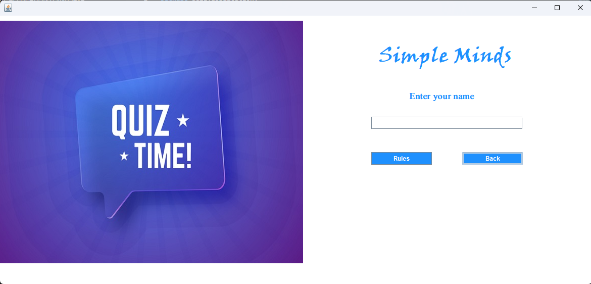
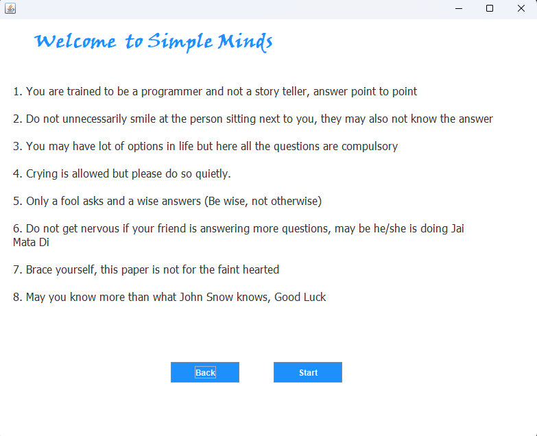
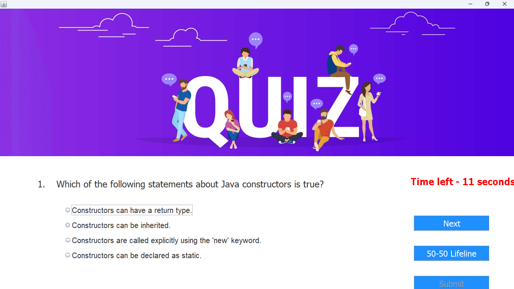
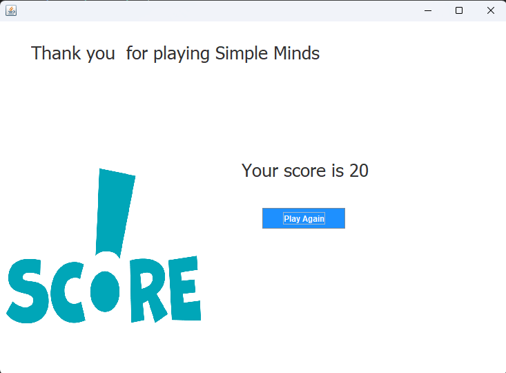

# 🎯 Quiz Application using Java

This is a simple GUI-based **Quiz Application** built in Java using **Swing**. It allows users to log in, view rules, take a timed quiz, and see their score at the end.

---

## 🚀 Features

- Login interface with name entry  
- Rules and instructions screen  
- Timed multiple-choice quiz  
- Score display after quiz submission  
- GUI built using Java Swing  
- Project structure compatible with NetBeans  

---

## 📷 Screenshots

### 🔐 Login Screen

### 📋 Rules Screen

### ❓ Quiz Screen

### 🧾 Score Screen

---

## 🛠 How to Run

1. Open the project in **ANY IDE**
2. Clean and Build the project
3. Run the application from the `Login.java` main class

---

## 💡 Future Enhancements

- Add a database to store user scores  
- Improve UI/UX with better graphics  
- Add support for more questions and categories  
- Timer customization and pause-resume feature  

---

## 📄 License

This project is open source and available under the [MIT License](LICENSE).
